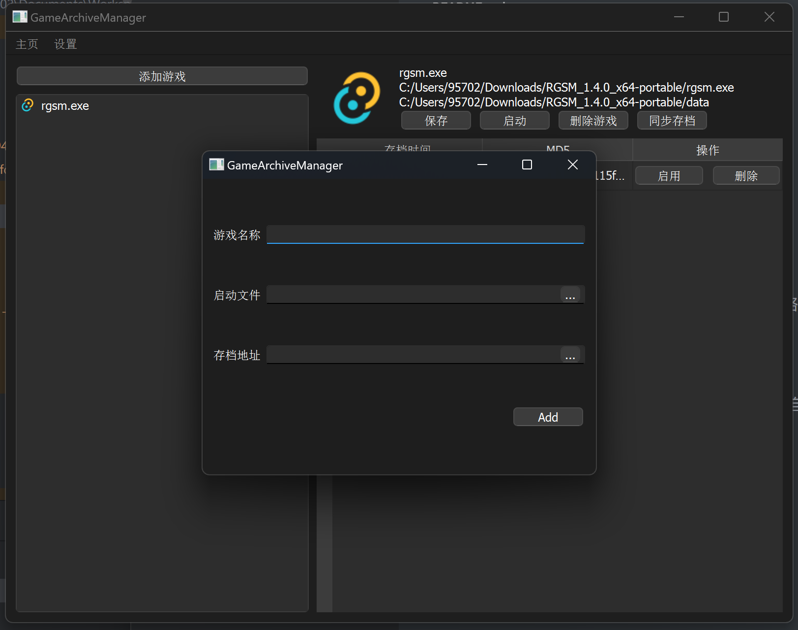
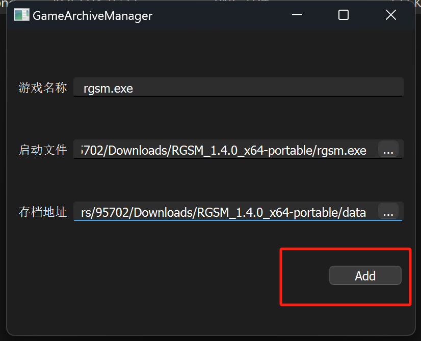
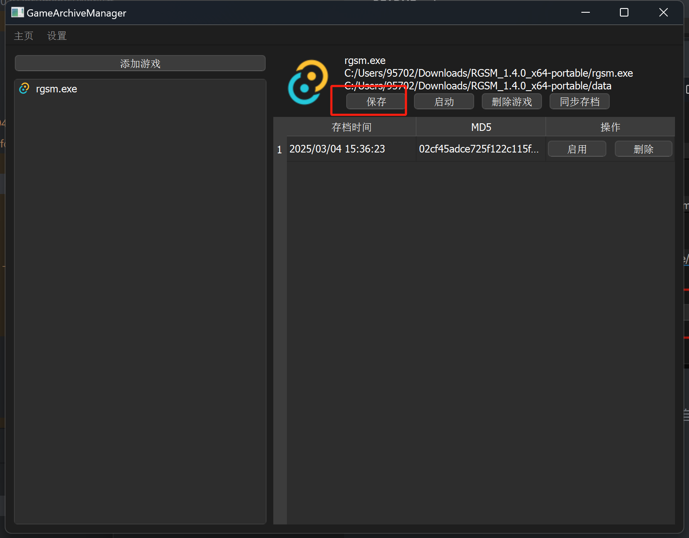

# 

## 使用

1. 打开管理器，点击添加游戏

2. 输入游戏存档路径（必填），游戏启动exe文件路径（选填）

   

3. 点击Add

   

4. 点击右侧保存，即可保存当前目录的zip存档文件

   

5. 通过存档管理器打开的游戏，在游戏关闭后，会自动进行一次存档

6. 同步存档会将本地最新存档的MD5值和远程最新存档的MD5值进行，比较然后选择上传或者覆盖

